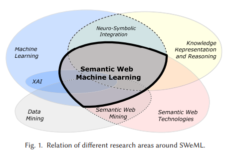
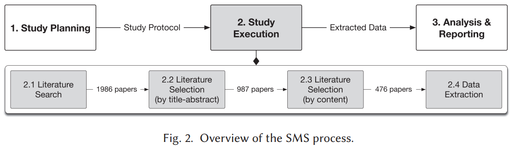
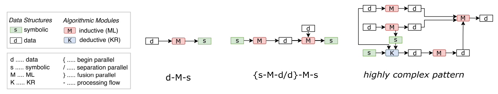
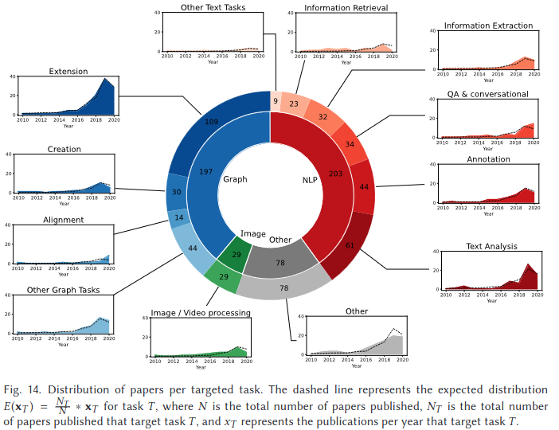
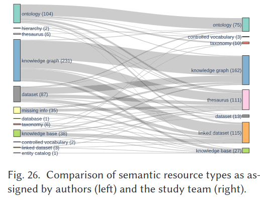
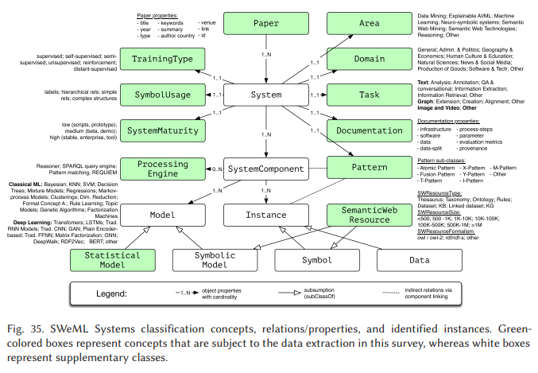

# <!--fit--> Combining Machine Learning and Semantic Web   A Systematic Mapping Study[1] 
### Originally by
Anna Breit, Semantic Web Company;et al. 
###  Presented By 
Brandon Dave
CS7820
SPR2024
Instructor: Dr. Cogan Shimizu

    [1]: https://dl.acm.org/doi/pdf/10.1145/3586163
<!-- 
    My name is...
    I will be presenting ... by ...
    This paper was the motivating article for Chapter 4 in the Red Compendium book titled: Semantic Web Machine Learning Systems: An Analysis of System Patterns.
-->

---
# Timeline
1. Key Terms
2. Challenges and Contributions
3. SMS Methodology
4. SWeML SMS Results
5. Conclusion
<!-- 
    The paper relates specifically to an emerging sub-area called Semantic Web Machine Learning which combines machine learning techniques with semantic web technologies. While not directly NeSy AI, SWeML falls into a type of NeSy AI.

    The flow of the presentation is outlined above.
    I will introduce some key terms necessary to follow this presentation
    I will summarize the paper's motivations and how they address observed challenges
    We will then explore the methodology the authors chose to analyze literature about SWeML including figures and result analysis
    And then top off the presentation with some conclusory notes
-->

---
# Key Terms
* Systematic Mapping Study (SMS)
* Semantic Web Machine Learning (SWeML) Systems
* SW Knowledge Structure

<!-- 
    The authors supply this graphic as a summarization of the overlapping fields that encompasses semantic web machine learning
    In this, we notice more than just semantic web technology and machine learning, but it also includes knowledge representation and reasoning (including NeSy), eXplainable ai, and data mining.
    Before we can dive into the paper, I want to mention some key terms and definitions to further solidify the contents of this presentation.
 -->

---
# Key Terms

* **Systematic Mapping Study (SMS)**
* Semantic Web Machine Learning (SWeML) Systems
* SW Knowledge Structure

> **Systematic Mapping Studies** (also known as Scoping Studies) are designed to provide a wide overview of a research area, to establish if research evidence exists on a topic and provide an indication of the quantity of the evidence. [2]

    [2]: Kitchenham, B., and Charters, S. Guidelines for performing systematic literature reviews in software engineering. 2007. 
<!-- 
    The first term to go over is, as noted in the title of the paper, "Systematic Mapping Study", denoted as SMS (not the text messaging service).

    Systematic Mapping Study is an established term that dates back to 2007. As the name suggests, it is a type of study.  One that complements literature reviews.  
    
    The evidences, or resultant data from the study process found by a particular domain of study, is mathematically mapped out.  Through this mapping, intuitive analyses reveals clusters of and deserts for systematic reviews while also identifying areas for future works of research.

    The result of a SMS highlights areas of interest relative to the domain in order to further conduct literature reviews. These interests can be research papers, conference proceedings, technical reports, and any number of other publications.
 -->

---
# Key Terms

* Systematic Mapping Study
* **Semantic Web Machine Learning (SWeML) Systems**
* SW Knowledge Structure

> SWeML Systems are the result of **combining SW technologies** and an **inductive** model.[1]

<!-- 
    Semantic Web Machine Learning, or SWeML, leverages techniques from machine learning in combination with semantic web technology to process, analyze, and derive insights from structured data.
    
    We understand that knowledge graphs are a complementary layer for machine learning models. Knowledge representation provides context to data; and, as such, a learned model results in increased accuracy while limiting hallucination of generated results.

    This may sound similar to NeSy AI; however, the distinction is that NeSy works with SWeML system in that these systems might incorporate deductive reasoners.

    For the purpose of the paper, the classifications generated by Semantic Web Machine Learning systems are published as an ontology.
 -->

---
# Key Terms

  

* Systematic Mapping Study
* SWeML Systems
* **SW Knowledge Structure**

> [A] symbolic representation of a conceptual domain model and data complying with such domain models.[1]

<!-- 

The final term is Semantic Web knowledge structure, which should feel like a familiar term as it simply pertains to structuring data with the use of semantic web technologies like RDF and OWL.

Of course, the actual implementation of these technologies poses its own challenge due to the simplicity or complexity a domain expert decides to represent structured data.
 --> 

---

<h2>RQs</h2>

1. What are the state of the art and trends related to systems that combine SW and ML components?
2. How can these systems be classified into a systematic taxonomy?

<h2>Challenges</h2>

1. "...keeping up with the main trends in the field has become unfeasible..."
2. "...the lack of a standardized way to report SWeML Systems..."

<h2>Contribution</h2>

1. A trends landscape
2. A classification system for SWeML Systems

<!-- 
    With all of that said, we can tie back into the author's paper, focusing on the research questions posed, the challenges observed, and the solutions presented.

    The author recognizes two major problems when using Semantic Web Machine Learning techniques, as the tasks are meant to solve domain specific problems. They also introduce 2 main contributions to tackle each challenge.
-->

---

<h2>Challenges</h2>

1. "...keeping up with the main trends in the field has become unfeasible..."

 

> [T]here is a need for a survey that adopts a solid review **methodology to complement current insights** with evidence-based findings.

<!-- 
    The first challenge poses concerns on staying up-to-date with the state-of-the-art as massive volumes counts of of papers are published in all domains of research. The authors include that research as a whole requires an adoptable surveying methodology to which is reproducible and returns is not too constrained or not too unbounded to a respective domain of research.

-->

---

<h2>Challenges</h2>

2. "...the lack of a standardized way to report SWeML Systems..."

 
 > [A]uthors of SWeML Systems would benefit from **a structured way to describe their system and its key characteristics**. 
 
 > Readers...would benefit from **a structured way of interpreting such systems**

<!--  
    The next challenge has a focus on how to document and report SWeML systems. A described, structured standard would benefit the interpretation of SWeML systems in other research communities, but also improve comparability between systems.
-->

---

<h2>Contribution</h2>

1. A trends landscape
2. A classification system for SWeML Systems

<!-- 
    The contributions from the authors of this paper are as follows:
    - Providing a trends landscape derived from a systematic survey (or study).  This landscape is intended to capture latent tendencies of SWeML systems level of a adoption, maturity, and reproducibility. 
    - A classification system that can be adopted as a template for existing and newly created SWeML systems. The key contribution to this system is the documentation and classification of a system's process flow.
-->

---
# SMS Methodology

<!-- 
    Included is a figure that graphically represents the Systematic Mapping Study methodology.

    Step 1 relates to the planning process by implementing a Study Protocol.

    A study protocol documents the refinment of research questions to more concrete categories in what needs answered. 
    
    For SWeML, these categories included:
        - bibiographic characteristics to search for.  Exploring research trends based on publication and geographic distribution
        - The System Architecture.  Investigating input/output 
        - Application Areas: How is SWeML Systems applied to domains?
        - Individual Aspects for Semantic Web and Machine Learning respectively
        - Existing System-based characteristics:  How transparent are they? What's the source code look like?

    Step 2 is the actual execution of the study process. This includes performing Literature Searches, Selections, and Extracting the specific Dataset from the literature. 

    A collection of techniques were performed in the data extraction process.  But they eventually ended up with 476 papers. Data from papers were collected through a response form, to define how and which data would be collected to answer the study questions in the Study Protocol.

    Step 3 is essentially an overall analysis and reporting back with respect to the abstracted research questsions as posed by the Study Protocol.

 -->

---
# RQ1
> RQ1 Bibliographic characteristics: 
How are the publications temporally and geographically distributed? How are the systems positioned, and which keywords are used to describe them?

<!-- 
    There were a total of 6 abstracted research questions that the authors covered in great detail.

    The first question related to analyzing publication metadata that resulted temporal and geographic publication.  These pose interesting discussions for the paper; however, for this class - there isn't much to observe here.  Temporally speaking, there was a rise from 2016-2019 with SWeML System publications.  
    
    The keywords they resulted in finding most commonly revolved around "machine learning" and "semantic web technologies", as one could guess from the title of the paper.  If a paper didn't use keywords, they performed information retrieval via word frequency to fill in the blanks.
-->

---
# RQ2
> RQ2 System architecture: 
What processing patterns are used in terms of inputs/outputs and the order of processing units?

<!-- 
    The second question analyzes SWeML Systems from a visual framework called boxology. Boxology simply breaks down complex visuals towards a more understanding and top-level perspective (with the understood crux of losing information).

    In boxology, a process workflow is broken down to 3 components, the input, the process-itself, and the output.

    The representation used in this paper allows researchers to reconstruct their machine learning models with adoptable patterns.

    On screen, we see white nodes represent non-symbolic data; such as images and numeric values, and green nodes represent symbolic data; such as, ontology rules.

    The red node indicates the machine learning model's algorithm.
-->

---
# RQ3
> RQ3 Application areas:
What kind of tasks are solved (e.g., text analysis)? In which domains are SWeML Systems applied (e.g., life sciences)?

<!--
    The next Research Question focuses on understanding use-cases for SWeML systems.

    From the name of SWeML systems, we understand there are two components: semantics and machine learning.

    The tasks SWeML systems solve are categorized in these super bars on the pie chart: 
        Red indicates NLP tasks
        Blue indicates Graph-based tasks
        Green represents Image processing tasks
        and the Gray represents Other miscellaneous tasks.

    The authors equally included temporal results in SWeML systems use-case evolution in their publication, and similarly to the rise in publication of SWeML systems, we see an uptick of systems being created/published between 2016-2019.

-->
---
# RQ4 and RQ5
> RQ4 Characteristics of the ML module: What ML models are incorporated (e.g., SVM)? Which ML components can be identified (e.g., attention)? What training type(s) is used during the system training phase?

> RQ5 Characteristics of the SW module: What type of SW structure is used (e.g., taxonomy)? What is the degree of semantic exploitation? What are the size and the formalism of the resources? Does the system integrate semantic processing modules (i.e., KR)?

<!--
    To extend from the previous research questions, we have research question 4 and 5 which play off one another.

    The authors decided to also analyze the semantic and machine learning modules individually and in combination with each other for SWeML systems.

    Machine learning modules can include the algorithm, or family of algorithms, in use but the results also delved into the domain of research to which a model was implemented.

    The results of this RQ showed that most SWeML systems primarily use supervised models. 

    For the other half, the authors asked similarly about the semantics published alongside these systems.

-->

---

<!--
    I've included another graphic to depict the study's mapped results.  The left hand side shows the terminology the publication author's use in their writing; while the right hand side shows the standardization of semantic resource types as defined by the SMS.  This uniforms some of the miscelaneous or not-popularly used categories together to more established terms.  For instance, the Semantic Web community had use of a semantic resource type, "entity catalog" which just gets captured as a "knowledge base".

    Alongside understanding resource types, the SMS goes further and analyzes which concrete resources are typically used (like DBPedia, YAGO, and Freebase.) and the structural components to these resources including their count of triples,

    In conclusion of RQ5, there did exist 29 papers that discuss the combination of Knowledge Representation and Machine Learning (for example, NeSy).  In these papers, the authors discuss how Machine Learning is typically implemented to abstract data into knowledge which is used by some knowledge representation.

-->

---
# RQ6
> RQ6 Maturity, transparency, and auditability: 
What is the level of maturity of the systems? How transparent are the systems in terms of sharing source code, details of infrastructure, and evaluation setup? Does the system have a provenance-capturing mechanism?

<!-- 
    And thus we get to the final research question posed by the study protocol.  This research question refers to the systems and their availability in source code, reproducibility in research, and their understanding of data transformation.

    The authors demonstrate maturity as 3 tiers (low, medium, and high) to which defines how a system was published.  Was it published with a fully-implemented and stable GUI or was it just a python script?

    Transparency refers to the documentation and ReadMe guides for systems. They found that system parameters and evaluation methods were published in great count of total literature. 

    and, finally, auditability reports on the capturability of data provenance in systems. The question asked would be something along the lines of if input data could still be traced back from the output layers.

-->
---
# <!--fit-->Summary  Contributions
* Formal definition of SWeML systems 
* In-depth analysis of SWeML
* Classification System as an ontology
* Facilitation of documentation

<!--
    One of the more notable contributions, with respect to the class, would be the overall analysis of metadata that resulted in allowing for SWeML systems to be ontologically described, as pictured.

    The entire study dissected the domain of the nascent field (of SWeML), discovering the inner- and outer-workings of SWeML, and formally describing the process while using boxology as a common frameworks for visual depictions to a system's data processing.

    This research allowed for a formalization of standard terminology which we see in the generated ontology. It also depicts the importance of documentation of newly implemented systems so similar surveying studies can be done.
-->
---

# Confusions
1. I got bamboozled by the name of this paper.

# Interests
1. In AI, there is a demand for model transparency and through documentation we can achieve that to some degree
2. Merging of frameworks for a comprehensive documentation standard

<!-- 
    When I first found this paper, I did a skim through and my eyes highlighted common terms we've discussed in this class.  In that sense, I thought this paper might have more discussion to NeSy AI or even represent a specific SWeML model, but discovered too late that it was, in fact, just a survey paper on literature reviewing.

    The paper I presented might not be concretely obvious to NeSy AI; however, I did find relevance in the methodology presented and as a solution for the demand for model transparency in supporting Explainable AI missions. 
    
    I also enjoyed the appendices as they do list out a list of semantic resources which can help for our course project. 

    In my conclusive opinion, it is no wonder that this paper was authored with 10 names. It was an extensive research with a lot of checkboxes to cross off.

-->
    