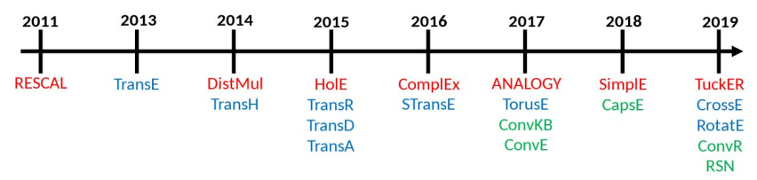

# Foundation for NeSy: Translational Distance KGE Models
Author:  Brandon Dave  
Course: CS7820: Neuro-Symbolic AI  
Semester: Spring 2024  
Instructor: Dr. Cogan Shimizu

## What We Know
1. CS7810: Graphical Representation of Data
2. CS7830: Machine Learning Models and Techniques

## NeSy Topics as presented by NeSy 2023
1. Knowledge representation and reasoning using deep neural networks;
2. Symbolic knowledge extraction from neural and statistical learning systems;
3. Explainable AI methods, systems and techniques integrating connectionist and symbolic AI;
4. Enhancing deep learning systems through structured background knowledge.
5. Neurosymbolic cognitive agents;
6. Biologically-inspired neurosymbolic integration;
7. Integration of logics and probabilities in neural networks;
8. Neurosymbolic methods for structure learning, transfer learning, meta, multi-task and continual learning, relational learning;
9. Novel connectionist systems able to perform traditionally symbolic AI tasks (e.g. abduction, deduction, out-of-distribution learning);
10. Novel symbolic systems able to perform traditionally connectionist tasks (e.g. learning from unstructured data, distributed learning);
11. Embedding methods for structured information, such as knowledge graphs, mathematical expressions, grammars, knowledge bases, logical theories, etc.
12. Applications of neurosymbolic and hybrid systems, including in simulation, finance, healthcare, robotics, semantic web, software engineering, systems engineering, bioinformatics and visual intelligence.

## Timeline
1. Introduction to KGE
2. Translational Distance KGE Models: TransE, TransR, TransH, RotatE
3. For each model:
    - Use-Case
    - Scoring Function
4. Understanding Evaluation metrics
5. Overall Research Continuation
    - Semantic Matching Models

## Knowledge Graph Embedding
1. Integrating a KG (the set of triples) into a vector plane
    - Inferring "facts" from the KG
    - Discovering new triples
    - Completing missing links
    - Analyzing clusterability

## Translational Distance
- These models rely on geometric translations for KGE
- As stated in the TransH paper:  
> "[K]nowledge graph embedding represents an entity as a k-dimensional vector h (or t) and **defines a scoring function fr(h, t) to measure the plausibility of the triplet (h, r, t) in the embedding space.** The score function implies a transformation r on the pair of entities which characterizes the relation r."

- Entity E1 exists at position (x,y)
- Relationship R1 modifies position by (x+a, y+b)
- What Entity E2 also exists at (x+a, y+b)?

## Common Connectivity Patterns
- **Symmetric**: if (a,r,b) then (b,r,a)
- **Anti-Symmetry**: if(a,r,b) then not(y,r,b)
- **Inversion**: if r1(a,b) then r2(a,b)
- **Composition**: If WSU is in Dayton and Dayton is in Ohio, WSU is in Ohio.
- **Cardinality Relationships**: (1-to-1, m-to-n)

## TransE
### Use-Case
- Handles 1-to-1 entity matching problems wrt. Head, Relationship, and Tail
- The scoring function can be used to answer what head entity and tail entity is with respect to a relationship that applies translation
- Represents Entities and Relationships on a 
*single* Embedding Space

## TransH
### Use-Case
- distributed representation of entities across different relations
- implements a hyperplane of existence that allows for the relationship-specific translation on entities
    - relationship-specific allows for coverage of more broad representation

## TransR
### Use-Case
- Handles m-to-n
- Maps entity-space and relationship-space to their own respective vector spaces.
- Provides capabilities to now represent various relationship r’s affect between entity and tail

## RotatE
### Use-Case
- Each relation represented as a rotation from the head entity to a tail entity
- Rotational Representation also allows for:
    - symmetry/antisymmetry, inversion, and composition

## Evaluation Metric
* **Hits@K**: The correct results show up in the first k-options
* **Mean Rank**: Average Ordinal Ranking across all elements
of the KGE
* **Mean Reciprocal Rank**: How likely is it, the correct option
appears in the first, second, third, ... nth place?

## In Summary

## In Summary (continued)

## Future Works: Semantic Matching
Questions that continue the research for KGE:
- How can we integrate KGE with AI to understand and represent semantics? (synonyms/antonyms, defining contextual meanings nd word associations)
    - What relationship can be inferred if an AI is
presented “cat” and “mouse”?
        - Cat _chases_ Mouse

## References
- Bordes, A., Usunier, N., Garcia-Durán, A., Weston, J., Yakhnenko, O.: Translating embeddings for modeling multi-relational data. In: Proceedings of the 26th International Conference on Neural Information Processing Systems - Volume 2. p.2787–2795. NIPS’13, Curran Associates Inc., Red Hook, NY, USA (2013)
- Lin, Y., Liu, Z., Sun, M., Liu, Y., Zhu, X.: Learning entity and relation embeddings for knowledge graph completion. Proceedings of the AAAI Conference on Artificial Intelligence 29(1) (Feb 2015). https://doi.org/10.1609/aaai.v29i1.9491, https://ojs.aaai.org/index.php/AAAI/article/view/9491
- Wang, Z., Zhang, J., Feng, J., & Chen, Z. (2014). Knowledge Graph Embedding by Translating on Hyperplanes. Proceedings of the AAAI Conference on Artificial Intelligence, 28(1). https://doi.org/10.1609/aaai.v28i1.8870
- Sun, Z., Deng, Z., Nie, J., Tang, J.: Rotate: Knowledge graph embedding by relational rotation in complex space. CoRR abs/1902.10197 (2019), http://arxiv.org/abs/1902.10197

- dglke: Introduction to Knowledge Graph Embedding. (2020). https://dglke.dgl.ai/doc/kg.html. Accessed on January 20, 2024.